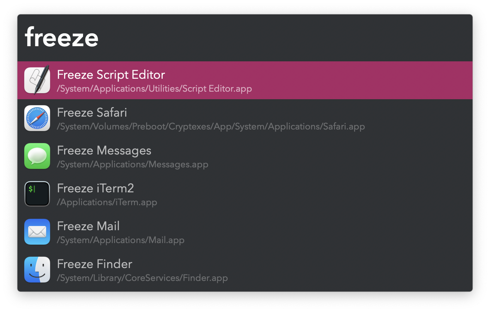

#  App Freeze Alfred Workflow

Pause and resume execution of the frontmost app

<a href='https://alfred.app/workflows/vitor/app-freeze'>⤓ Install From the Alfred Gallery</a>

## Usage

Pause execution of the frontmost app via the Freeze Keyword (default: `freeze`). Resume with the Unfreeze Keyword (default: `unfreeze`). Inspired by the [Universal Pause Button](https://github.com/ryanries/UniversalPauseButton/blob/dc5a3d5173e153012fee850e557755e250da9105/README.md).

Configure the [Hotkeys](https://www.alfredapp.com/help/workflows/triggers/hotkey/) for faster triggering.
